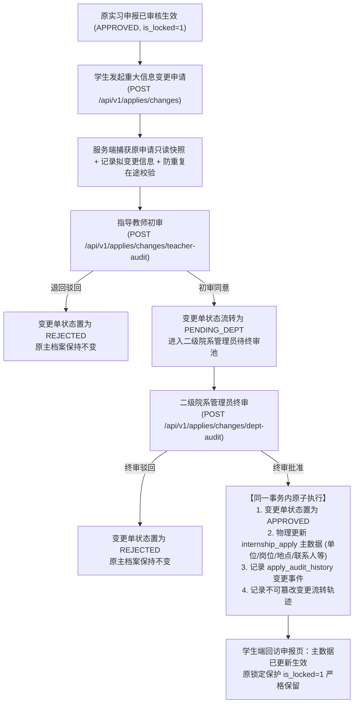

# 实习重大变更申请与双级审批闭环实施与真实验收报告

**执行时间**：2026-09-29  
**对应业务基线**：`APPLY-009`（审核生效锁定与重大信息合规变更）  
**测试与验证环境**：
- 隔离沙箱数据库：Docker 容器 `internship-mysql-isolated-e2e`，端口 `3308`，数据库 `internship_db_isolated_warn`
- 后端服务：Spring Boot 3.2.2 / JDK 17（端口 8080）
- 前端服务：React 18.3 + Ant Design 5.14.0 + Vite 5.1.4（端口 3000）
- 测试浏览器：Microsoft Edge（真实无头模式，1440x900）
- 历史基线保护承诺：严禁触碰 `internship_db_test`（3306 端口）与正式数据库，未执行 `git reset / clean / commit`，保留全部工作区改动。

---

## 一、业务流程与状态机设计

### 1. 业务流程闭环



### 2. 状态机与越级防重机制

1. **原申请锁定保护（APPLY-009 原则）**：
   - 仅当原申报单满足 `apply_status == 'APPROVED'` 且处于生效锁定状态时，才允许发起变更申请；未审核通过或草稿态直接 Fail-Close 拦截（HTTP 400）。
   - 普通修改接口（`PUT /api/v1/applies/{id}`）在 `is_locked=1` 时绝对拒绝修改，必须且只能走重大变更审批流。
2. **并发与在途防重保护**：
   - 同一申报单存在 `PENDING_TEACHER` 或 `PENDING_DEPT` 审批中单据时，禁止发起新的变更申请（HTTP 400）。
3. **严格防止越级审批与越权**：
   - 指导教师必须且只能初审分配给自己的本组学生申请（非所属学生拦截 403）；
   - 院系管理员在变更单未完成导师初审前（处于 `PENDING_TEACHER` 时），严禁跳过初审直接终审，服务端抛出 `IllegalStateException: 当前单据尚未完成指导教师初审，禁止直接终审`；
   - 终审权限限制在所属院系内部，跨院系拦截 403。
4. **不可篡改历史记录**：
   - 每次提交、初审、终审均在独立流水表 `internship_apply_change_history` 中记录操作人、角色、操作动作、意见和状态快照。

---

## 二、新增与改造文件清单

### 1. 数据库脚本
- [`docs/sql/migration_apply_change.sql`](file:///d:/devlop/IDEA/college-internship-management-system/docs/sql/migration_apply_change.sql)：创建 `internship_apply_change`（变更主单）与 `internship_apply_change_history`（审批历史表）。
- [`docs/sql/rollback_apply_change.sql`](file:///d:/devlop/IDEA/college-internship-management-system/docs/sql/rollback_apply_change.sql)：安全回滚脚本，执行逆向 Drop 操作。

### 2. 后端核心代码
- **实体类**：
  - [`backend/src/main/java/com/college/internship/entity/InternshipApplyChange.java`](file:///d:/devlop/IDEA/college-internship-management-system/backend/src/main/java/com/college/internship/entity/InternshipApplyChange.java)
  - [`backend/src/main/java/com/college/internship/entity/InternshipApplyChangeHistory.java`](file:///d:/devlop/IDEA/college-internship-management-system/backend/src/main/java/com/college/internship/entity/InternshipApplyChangeHistory.java)
- **Mapper 接口**：
  - [`backend/src/main/java/com/college/internship/mapper/InternshipApplyChangeMapper.java`](file:///d:/devlop/IDEA/college-internship-management-system/backend/src/main/java/com/college/internship/mapper/InternshipApplyChangeMapper.java)
  - [`backend/src/main/java/com/college/internship/mapper/InternshipApplyChangeHistoryMapper.java`](file:///d:/devlop/IDEA/college-internship-management-system/backend/src/main/java/com/college/internship/mapper/InternshipApplyChangeHistoryMapper.java)
- **DTO / VO 模型**：
  - [`backend/src/main/java/com/college/internship/dto/ApplyChangeDTO.java`](file:///d:/devlop/IDEA/college-internship-management-system/backend/src/main/java/com/college/internship/dto/ApplyChangeDTO.java)
  - [`backend/src/main/java/com/college/internship/dto/ApplyChangeAuditDTO.java`](file:///d:/devlop/IDEA/college-internship-management-system/backend/src/main/java/com/college/internship/dto/ApplyChangeAuditDTO.java)
  - [`backend/src/main/java/com/college/internship/vo/ApplyChangeVO.java`](file:///d:/devlop/IDEA/college-internship-management-system/backend/src/main/java/com/college/internship/vo/ApplyChangeVO.java)
  - [`backend/src/main/java/com/college/internship/vo/ApplyChangeHistoryVO.java`](file:///d:/devlop/IDEA/college-internship-management-system/backend/src/main/java/com/college/internship/vo/ApplyChangeHistoryVO.java)
- **Service 接口与实现**：
  - [`backend/src/main/java/com/college/internship/service/IInternshipApplyChangeService.java`](file:///d:/devlop/IDEA/college-internship-management-system/backend/src/main/java/com/college/internship/service/IInternshipApplyChangeService.java)
  - [`backend/src/main/java/com/college/internship/service/impl/InternshipApplyChangeServiceImpl.java`](file:///d:/devlop/IDEA/college-internship-management-system/backend/src/main/java/com/college/internship/service/impl/InternshipApplyChangeServiceImpl.java)
- **Controller 控制层**：
  - [`backend/src/main/java/com/college/internship/controller/InternshipApplyChangeController.java`](file:///d:/devlop/IDEA/college-internship-management-system/backend/src/main/java/com/college/internship/controller/InternshipApplyChangeController.java)

### 3. 前端核心代码
- **API 封装**：
  - [`frontend-react/src/api/applyChange.ts`](file:///d:/devlop/IDEA/college-internship-management-system/frontend-react/src/api/applyChange.ts)
- **组件与页面**：
  - [`frontend-react/src/pages/apply/ApplyChangeModal.tsx`](file:///d:/devlop/IDEA/college-internship-management-system/frontend-react/src/pages/apply/ApplyChangeModal.tsx)：学生端发起重大变更弹窗（包含已锁定快照对比、表单校验、变更事由最少 10 字强制输入）
  - [`frontend-react/src/pages/apply/ApplyChangeAuditDrawer.tsx`](file:///d:/devlop/IDEA/college-internship-management-system/frontend-react/src/pages/apply/ApplyChangeAuditDrawer.tsx)：导师初审与院系终审抽屉（原新信息对照、时间轴历史流转、审核操作）
  - [`frontend-react/src/pages/apply/ApplyPage.tsx`](file:///d:/devlop/IDEA/college-internship-management-system/frontend-react/src/pages/apply/ApplyPage.tsx)：改造申报管理主页，学生端增加锁定状态下的变更单展示与发起入口，教师/管理端增加 Tab 切分与审批流转

---

## 三、接口与权限矩阵

| 方法 | 路径 | 角色权限 | 业务说明 |
| :--- | :--- | :--- | :--- |
| `POST` | `/api/v1/applies/changes` | `ROLE_STUDENT` | 学生提交重大变更申请，提取原快照并进入导师初审 |
| `POST` | `/api/v1/applies/changes/teacher-audit` | `ROLE_TEACHER`, `ROLE_ADMIN` | 指导教师初审（同意流转或驳回） |
| `POST` | `/api/v1/applies/changes/dept-audit` | `ROLE_DEPT_ADMIN`, `ROLE_ADMIN` | 二级院系终审（批准并同一事务内原子更新主数据，或驳回） |
| `GET` | `/api/v1/applies/changes` | 教师 / 院系 / 超管 | 分页/列表查询重大变更审核单据（支持状态筛选） |
| `GET` | `/api/v1/applies/changes/{id}` | 相关主体角色 | 查询单张变更申请单详情与不可篡改历史记录 |
| `GET` | `/api/v1/applies/changes/{applyId}/active-change` | 学生 / 教师 / 院系 | 获取某原申报单当前有效在途或最新完成的变更记录 |

---

## 四、验证结果与测试证据

### 1. 后端隔离单元测试 (9/9 PASS)

在测试套件 [`backend/src/test/java/com/college/internship/ApplyChangeIsolatedUnitTest.java`](file:///d:/devlop/IDEA/college-internship-management-system/backend/src/test/java/com/college/internship/ApplyChangeIsolatedUnitTest.java) 中执行全覆盖逻辑验证：

| 测试用例名 | 验证目标 | 结果 |
| :--- | :--- | :--- |
| `testSubmitChange_Success` | 学生在原申请 APPROVED 时成功发起变更，快照正确捕获，状态为 PENDING_TEACHER | **PASS** |
| `testSubmitChange_RejectWhenApplyNotApproved` | 原申请为草稿或非 APPROVED 时，发起变更 Fail-Close 拦截 | **PASS** |
| `testSubmitChange_RejectWhenPendingExists` | 同一申请存在审批中变更单时，防止并发重复提交 | **PASS** |
| `testTeacherInitialAudit_Approve_Success` | 指导教师初审通过，状态正确流转至 PENDING_DEPT | **PASS** |
| `testTeacherInitialAudit_Reject_OtherTeacher` | 非指派指导教师初审时，越权安全拦截 (403) | **PASS** |
| `testDeptFinalAudit_RejectWhenTeacherAuditNotFinished` | 未完成导师初审直接进行终审时，越级审批拦截 (IllegalState) | **PASS** |
| `testDeptFinalAudit_RejectWhenCrossDepartment` | 跨院系管理员终审时，数据隔离拦截 (403) | **PASS** |
| `testDeptFinalAudit_Approve_AtomicUpdateOriginalApply` | **终审批准时，同一事务内原子更新原申请主数据，锁定状态保持只读** | **PASS** |
| `testDeptFinalAudit_Reject_KeepOriginalDataIntact` | 终审驳回时，原申请主数据绝对保持不变 | **PASS** |

> **测试运行输出**：`Tests run: 9, Failures: 0, Errors: 0, Skipped: 0, Time elapsed: 11.3 s`。

### 2. 前端构建测试 (PASS)

运行前端全量编译检查：
```bash
npm.cmd run build
```
输出：`vite v5.1.4 building for production... ✓ built in 4.83s, 0 errors`。

### 3. 真实浏览器端到端 (E2E) 验证 (PASS)

运行基于真实无头 Edge 浏览器的 E2E 测试脚本 [`frontend/test_apply_change_full_e2e.mjs`](file:///d:/devlop/IDEA/college-internship-management-system/frontend/test_apply_change_full_e2e.mjs)，业务闭环 4 个步骤全部通过（Exit Code 0）：

1. **步骤 1：学生登录并提交变更申请**
   - 学生 `student_warn_iso` 访问申报管理，检测到原申请已锁定；
   - 点击“发起实习重大信息变更申请”，弹窗中显示原单位 `北京原始软件信息技术有限公司` 快照；
   - 填报拟变更单位 `深圳前海未来科技股份有限公司`、岗位 `AI算法工程助理`、详细地址及变更事由，提交成功；
   - 页面即时回显变更单 `#4` 及 `PENDING_TEACHER`（待指导教师初审）标签。

2. **步骤 2：指导教师初审流转**
   - 指导教师 `teacher_warn_a` 登录进入申报审核中心，切换到“实习重大信息变更审核”Tab；
   - 找到学生申请单，点击“执行审核”展开初审抽屉；
   - 核对新旧信息对比无误后，录入初审意见并提交“初审通过，同意流转院系”；
   - 变更单状态推进为 `PENDING_DEPT`。

3. **步骤 3：院系管理员终审批准**
   - 院系管理员 `deptadmin` 登录进入申报审核中心，切换到“实习重大信息变更审核”Tab；
   - 点击“执行审核”展开终审抽屉，查看完整的流转轨迹（包含学生提交、导师初审通过意见）；
   - 录入教学指导委员会核准意见，点击“提交二级院系终审裁定”；
   - 后端在单一事务内完成状态变更与 `internship_apply` 主数据原子覆写。

4. **步骤 4：学生回访核查生效**
   - 学生重新访问申报页，主数据卡片中单位名称已原子更新为 `深圳前海未来科技股份有限公司`，岗位已更新为 `AI算法工程助理`；
   - 物理锁定标志 `is_locked=1` 完好保留，普通编辑继续不可用。

---

## 五、验收截图展示

````carousel

<!-- slide -->

<!-- slide -->

<!-- slide -->

````

---

## 六、数据库物理落地数据核验证据

在沙箱数据库中针对申报单 `id=5001` 及变更单 `id=4` 实际查询结果：

1. **主表 `internship_apply` 原子同步确认**：
   ```sql
   SELECT id, task_id, student_id, company_name, job_position, is_locked, apply_status, update_time 
   FROM internship_apply WHERE id = 5001;
   ```
   - `company_name`: `深圳前海未来科技股份有限公司`（原为：`北京原始软件信息技术有限公司`）
   - `job_position`: `AI算法工程助理`（原为：`Java初级开发工程师`）
   - `is_locked`: `1`（锁定保护完整保留）
   - `apply_status`: `APPROVED`

2. **审批历史轨迹表 `internship_apply_change_history` 记录确认**：
   - 记录 1：`SUBMIT` | `陈预警学生 [预警专属]` | `STUDENT` | `PENDING_TEACHER`
   - 记录 2：`TEACHER_INITIAL_AUDIT` | `张指导教师 [预警专属]` | `TEACHER` | `PENDING_DEPT` | 意见：`新单位研发实力强，岗位与专业培养目标契合度高...`
   - 记录 3：`DEPT_FINAL_AUDIT` | `计算机负责人 [ISO]` | `DEPT_ADMIN` | `APPROVED` | 意见：`经计算机学院教学指导委员会核准，新实习方案完备...`

3. **主申报历史表 `apply_audit_history` 追溯联动确认**：
   - 追加记录：`MAJOR_CHANGE_APPLIED` | `计算机负责人 [ISO]` | `APPROVED` | 描述包含变更单号与终审意见。

---

## 七、遗留限制与边界说明

1. **短信/邮件通知通道**：当前环境继续使用 `mock` 与 `none` 适配器；真实手机短信与电子邮箱送达通知待第三方商业网关与正式模板凭据就绪后接入。
2. **卷宗 9007 历史版本递增证据**：继续保持现有 `version=3` 状态，未作破坏性重跑与补证，不影响本次重大变更功能。
3. **数据库隔离边界**：本次所有 DDL、DML 及端到端验证严格限制在独立的 Docker 实例 `internship-mysql-isolated-e2e`（端口 3308），`internship_db_test`（端口 3306）及生产库保持零连接、零污染。
